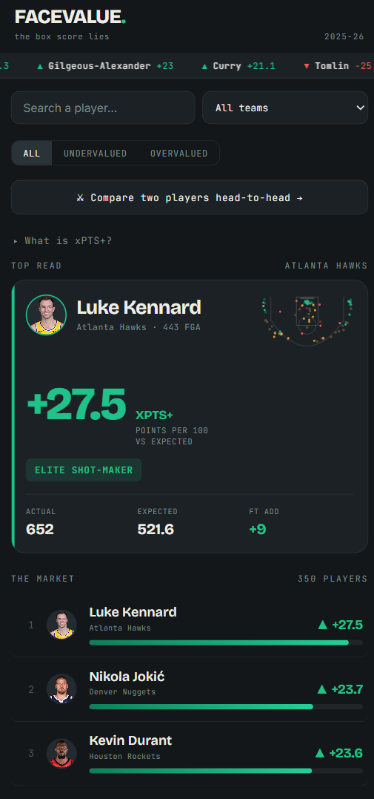
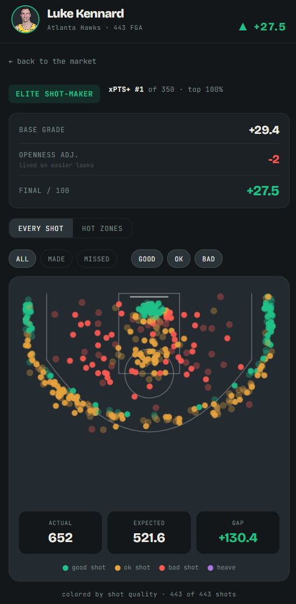
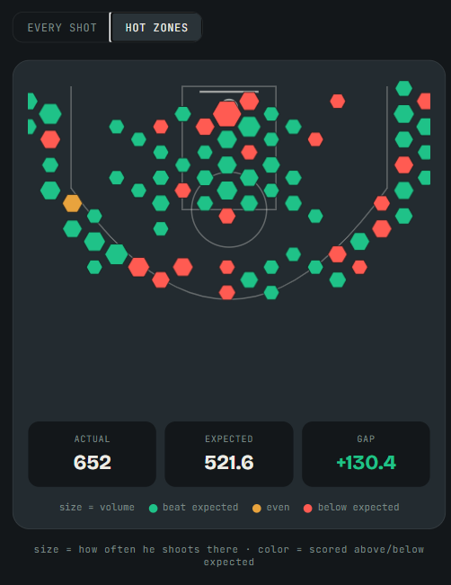
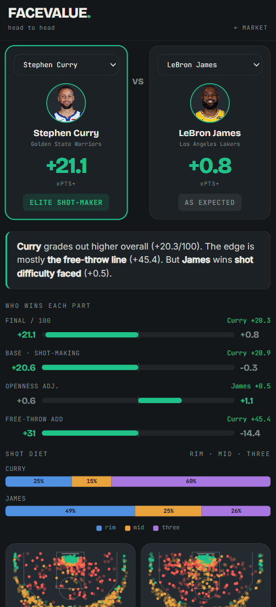

# Face Value — `xPTS+`

**The box score lies.** Scoring 25 points on wide-open looks isn't the same as scoring 25 on contested ones — but the stat sheet treats them identically. Face Value is a shot-quality analytics engine that grades NBA players on whether they **beat the difficulty of their own shots**, separating real shot-makers from empty volume scorers.

🔗 **Live app:** [face-value.vercel.app](https://face-value-pi.vercel.app/)

<!-- IMAGE 1 — HERO SCREENSHOT
     A wide screenshot of the home screen: the board with the green/red xPTS+ bars,
     ticker at top, a recognizable name (Jokić / Durant) visible.
     This is the first thing people see — make it the best-looking one. -->



---

## What it does

Face Value introduces **xPTS+**, a single number that measures how many points a player scores **above or below expectation, per 100 shots**, given how hard their shots actually were.

- **0** = exactly league-average shot-maker
- **+20** = elite (Kennard, Jokić, Durant territory)
- **−15** = empty volume / cold / forced shots

It reframes the league as a **market**: players who beat their shots are _undervalued_ (green), players living on easy looks are _overvalued_ (red).

<!-- IMAGE 2 — PLAYER PAGE
     A player detail screenshot showing: the headshot, the xPTS+ number + rank line,
     the Base → Openness → Final breakdown, and the shot chart (scatter).
     Pick a star (Jokić or Durant) so it's recognizable. -->



---

## How `xPTS+` works

**1. A model learns how hard every shot is.** A gradient-boosted classifier is trained on **~219,000 real shots** from the current season. For any shot it outputs a make probability from its location, distance, shot type, and zone — without ever being told that "a layup is easy." It learns that from the data (AUC ≈ 0.66, well-calibrated: predicted-40% shots go in ~40% of the time).

**2. Make probability → expected points (xPTS).** `xPTS = P(make) × shot value`. An open three (~0.38 × 3 = 1.15) is correctly valued _higher_ than a contested mid-range two (~0.40 × 2 = 0.80) — the analytics truth that raw shooting % hides.

**3. Grade = actual vs. expected.** Sum each player's xPTS (what an average player would score on their shots), compare to what they actually scored — field goals **and** free throws — per 100 attempts.

**4. Openness adjustment (v2).** The NBA's closest-defender tracking data feeds a player-level correction: players who take **more contested** shots than average get credit; players living on **wide-open** looks get docked. This is what stops the model from treating a contested Giannis layup like an open one.

<!-- IMAGE 3 — SHOT CHART / HOT ZONES
     The "Hot Zones" hexbin heatmap view of a player's shot chart
     (hex size = frequency, color = above/below expected). Visually striking — good pick. -->



---

## The validation that sold me on it

The hard part of any metric like this is proving it measures _real skill_ and not noise. Two checks:

- **Synthetic test:** I generated fake players with a _hidden_ shot-making skill, never shown to the model. The metric recovered that hidden skill at **0.96 correlation** — near-perfect.
- **Real-data sanity check:** with zero names given to it, the model independently ranked **Kevin Durant, Nikola Jokić, Shai Gilgeous-Alexander, and Stephen Curry** at the top — exactly the players it should.

<!-- IMAGE 4 — COMPARE MODE
     The head-to-head compare page (e.g. Kennard vs Jokić) showing the auto-verdict
     sentence, the diff bars, and the shot-diet breakdown. Best "this is a product" shot. -->



---

## Features

- **The market** — every player ranked by xPTS+, searchable and filterable by team, undervalued/overvalued
- **Player pages** — full grade breakdown (base → openness → final), league rank, and interactive shot charts
- **Two shot-chart lenses** — _Every shot_ (scatter, hover any dot to inspect it) and _Hot zones_ (hexbin heatmap)
- **Head-to-head compare** — pick two players, get an auto-generated verdict, stat-by-stat diff bars, and a shot-diet breakdown
- **Live, animated, mobile-first** — built to be screenshotted and shared

## Tech stack

- **Model / data:** Python, scikit-learn (`HistGradientBoostingClassifier`), pandas, `nba_api`
- **App:** Next.js (App Router), React, custom SVG shot charts, plain CSS
- **Deploy:** Vercel

## What `xPTS+` does _not_ measure

Honest scope matters. xPTS+ measures **scoring efficiency vs. shot difficulty** — not playmaking, defense, rebounding, or foul-drawing volume (it only counts free throws actually made). A volume-and-force scorer can rate neutral or negative, and that's the metric being honest, not broken.

## Run it yourself

```bash
# 1. Generate the data (model + xPTS+ for a season)
pip install scikit-learn pandas numpy nba_api
python face_value_v1_final.py --season 2025-26 --v2
cp players.json public/players.json

# 2. Run the app
npm install
npm run dev   # http://localhost:3000
```

---

_Built by Aryaan Habib — [LinkedIn](https://www.linkedin.com/in/aryaan-habib-1040b8226/) · [Live app](https://face-value-pi.vercel.app/)_
